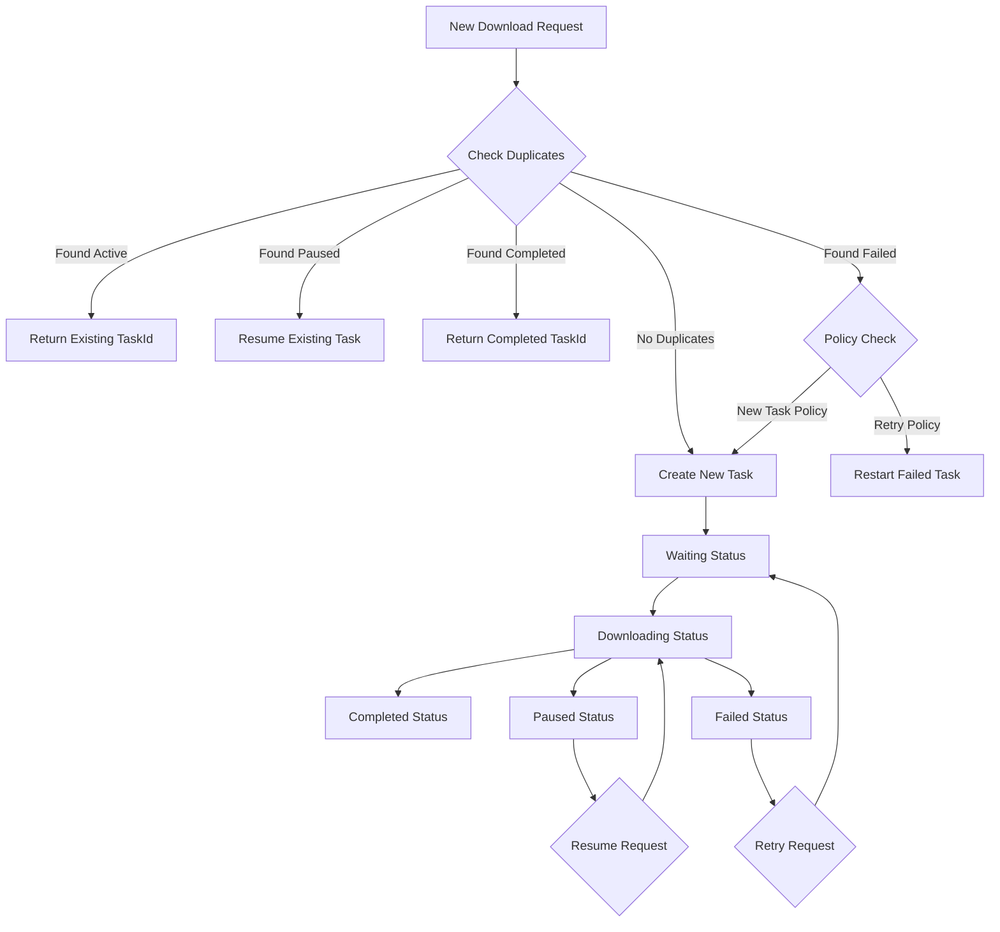
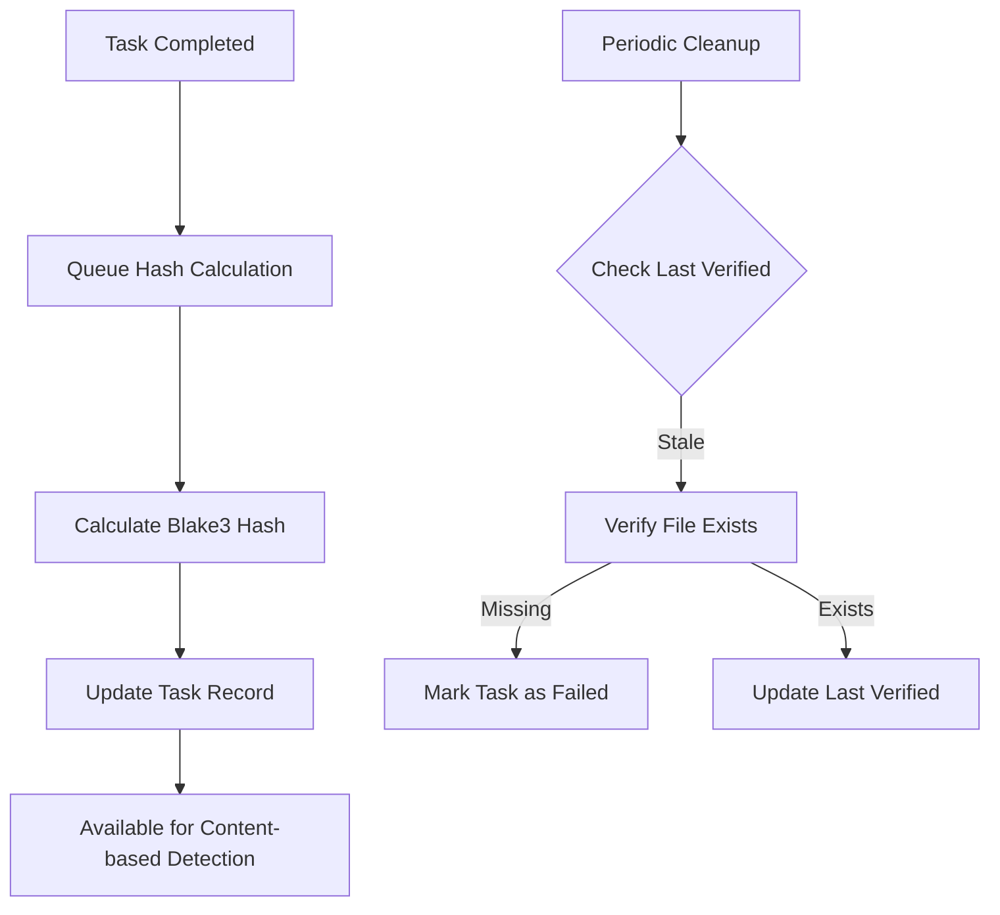

# Data Model: Duplicate Download Detection

**Date**: 2025-10-09
**Feature**: 001-burncloud-download-task
**Phase**: 1 - Data Model Design

## Overview

This data model extends the existing burncloud-download data structures to support duplicate detection and task reuse. The design builds on the current SQLite-based persistence layer while adding minimal new fields for efficient duplicate identification.

## Core Entities

### DownloadTask (Extended)

**Purpose**: Represents a download operation with duplicate detection capabilities

**Extended Fields for Duplicate Detection:**
```rust
pub struct DownloadTask {
    // Existing fields (unchanged)
    pub id: TaskId,
    pub url: String,
    pub target_path: PathBuf,
    pub status: DownloadStatus,
    pub created_at: SystemTime,
    pub updated_at: SystemTime,

    // New fields for duplicate detection
    pub file_hash: Option<String>,          // Blake3 hash of file content
    pub file_size_bytes: Option<u64>,       // File size for quick filtering
    pub url_hash: String,                   // Normalized URL hash
    pub last_verified_at: Option<SystemTime>, // Last time task validity was checked
}
```

**Field Descriptions:**
- `file_hash`: Blake3 hash of downloaded file content (computed after completion)
- `file_size_bytes`: Expected or actual file size for quick duplicate filtering
- `url_hash`: Hash of normalized URL for fast duplicate detection
- `last_verified_at`: Timestamp of last validity check (file exists, source accessible)

**Database Schema:**
```sql
-- Extend existing download_tasks table
ALTER TABLE download_tasks ADD COLUMN file_hash TEXT;
ALTER TABLE download_tasks ADD COLUMN file_size_bytes INTEGER;
ALTER TABLE download_tasks ADD COLUMN url_hash TEXT NOT NULL DEFAULT '';
ALTER TABLE download_tasks ADD COLUMN last_verified_at TIMESTAMP;

-- Indexes for fast duplicate detection
CREATE INDEX idx_file_hash ON download_tasks(file_hash) WHERE file_hash IS NOT NULL;
CREATE INDEX idx_url_hash ON download_tasks(url_hash);
CREATE INDEX idx_url_target ON download_tasks(url_hash, target_path);
CREATE INDEX idx_status_updated ON download_tasks(status, updated_at);
```

### FileIdentifier (New)

**Purpose**: Composite key for identifying duplicate downloads

```rust
#[derive(Debug, Clone, PartialEq, Eq, Hash)]
pub struct FileIdentifier {
    pub url_hash: String,           // Hash of normalized URL
    pub target_path: PathBuf,       // Target download path
    pub file_size: Option<u64>,     // File size if available
}

impl FileIdentifier {
    pub fn new(url: &str, target_path: &Path, file_size: Option<u64>) -> Self {
        let normalized_url = normalize_url(url);
        let url_hash = blake3::hash(normalized_url.as_bytes()).to_hex().to_string();

        Self {
            url_hash,
            target_path: target_path.to_path_buf(),
            file_size,
        }
    }

    pub fn matches_task(&self, task: &DownloadTask) -> bool {
        self.url_hash == task.url_hash &&
        self.target_path == task.target_path
    }
}
```

**Usage**: Used for efficient duplicate detection queries and in-memory comparisons.

### TaskStatus (Extended)

**Purpose**: Enhanced task status with duplicate detection states

```rust
#[derive(Debug, Clone, PartialEq, Eq, Serialize, Deserialize)]
pub enum DownloadStatus {
    // Existing statuses (unchanged)
    Waiting,
    Downloading,
    Paused,
    Completed,
    Failed(String),

    // New status for duplicate detection
    Duplicate(TaskId),              // References the original task
}
```

**New Status Description:**
- `Duplicate(TaskId)`: Indicates this request was identified as duplicate of existing task

### DuplicatePolicy (New)

**Purpose**: Defines how to handle duplicate downloads

```rust
#[derive(Debug, Clone, PartialEq, Eq)]
pub enum DuplicatePolicy {
    ReuseExisting,                  // Return existing task_id (default)
    AllowDuplicate,                 // Create new task anyway
    PromptUser,                     // Ask user for decision
    ReuseIfComplete,                // Reuse only if original is completed
    ReuseIfIncomplete,              // Reuse only if original is incomplete
}
```

**Default Behavior**: `ReuseExisting` - matches constitutional requirement to prevent duplicates.

## Entity Relationships

### Primary Relationships

```
DownloadTask 1:1 FileIdentifier (computed)
    - FileIdentifier is derived from DownloadTask fields
    - Used for duplicate detection queries

DownloadTask 1:* DownloadTask (duplicate relationships)
    - Tasks can reference other tasks as duplicates
    - Tracked via DuplicateStatus::Duplicate(TaskId)

DuplicatePolicy 1:* DuplicateDetection (policy application)
    - Policy determines behavior when duplicates found
    - Applied per duplicate detection operation
```

### Database Relationships

```sql
-- Self-referential relationship for duplicates
-- (Tracked via status field, not foreign key)

-- Indexes support efficient queries
SELECT id FROM download_tasks
WHERE url_hash = ? AND target_path = ?
ORDER BY updated_at DESC;

-- File-based duplicate detection
SELECT id FROM download_tasks
WHERE file_hash = ? AND file_hash IS NOT NULL
ORDER BY updated_at DESC;
```

## Validation Rules

### Task Validation

**URL Hash Generation:**
- URLs must be normalized before hashing
- Remove fragments, normalize scheme (http->https), sort query parameters
- Use Blake3 for consistent, fast hashing

**File Size Validation:**
- File size optional during creation, required for completion
- Size mismatch triggers validation failure
- Used for quick filtering before expensive hash calculation

**Status Transitions:**
```rust
// Valid transitions from existing statuses
Waiting -> Downloading, Paused, Failed, Duplicate
Downloading -> Paused, Completed, Failed
Paused -> Downloading, Failed, Duplicate
Completed -> (no transitions)
Failed -> Waiting, Duplicate
Duplicate -> (no transitions - points to original task)
```

### Duplicate Detection Rules

**Primary Detection (URL + Path):**
1. Normalize URL (remove fragments, standardize format)
2. Generate url_hash using Blake3
3. Query database for matching url_hash + target_path
4. Return most recent valid task if found

**Secondary Detection (File Content):**
1. Check file_hash if available
2. Compare file_size_bytes for quick filtering
3. Return tasks with matching content hash

**Validation Hierarchy:**
1. Active downloads (Waiting, Downloading) - highest priority for reuse
2. Paused downloads - second priority for resume
3. Completed downloads - third priority for reuse
4. Failed downloads - lowest priority, may restart

## State Transitions

### Task Lifecycle with Duplicate Detection



### Background Hash Calculation



## Performance Characteristics

### Query Performance

**Duplicate Detection Queries:**
- URL-based: O(log n) with index lookup
- File-based: O(log n) with hash index
- Combined: O(log n) worst case

**Expected Response Times:**
- URL duplicate check: <1ms
- File hash lookup: <5ms
- Background hash calculation: Variable (depends on file size)

### Storage Requirements

**Additional Storage per Task:**
- `file_hash`: 64 bytes (Blake3 hex string)
- `file_size_bytes`: 8 bytes (u64)
- `url_hash`: 64 bytes (Blake3 hex string)
- `last_verified_at`: 8 bytes (timestamp)
- **Total**: ~144 bytes per task

### Scalability Considerations

**Database Scaling:**
- SQLite handles 1M+ tasks efficiently with proper indexing
- Indexes consume ~16 bytes per task for hash lookups
- Background hash calculation scales linearly with file size

**Memory Usage:**
- FileIdentifier: ~100 bytes per active comparison
- In-memory duplicate cache: Optional optimization for frequent checks
- Minimal impact on existing memory usage

## Migration Strategy

### Database Migration

```sql
-- Migration script (idempotent)
BEGIN TRANSACTION;

-- Add new columns (nullable for backward compatibility)
ALTER TABLE download_tasks ADD COLUMN file_hash TEXT;
ALTER TABLE download_tasks ADD COLUMN file_size_bytes INTEGER;
ALTER TABLE download_tasks ADD COLUMN url_hash TEXT;
ALTER TABLE download_tasks ADD COLUMN last_verified_at TIMESTAMP;

-- Populate url_hash for existing tasks
UPDATE download_tasks
SET url_hash = blake3_hash(normalize_url(url))
WHERE url_hash IS NULL;

-- Make url_hash non-null for future inserts
-- (handled in application code, not schema constraint)

-- Create indexes
CREATE INDEX IF NOT EXISTS idx_file_hash ON download_tasks(file_hash) WHERE file_hash IS NOT NULL;
CREATE INDEX IF NOT EXISTS idx_url_hash ON download_tasks(url_hash);
CREATE INDEX IF NOT EXISTS idx_url_target ON download_tasks(url_hash, target_path);

COMMIT;
```

### Code Migration

**Backward Compatibility:**
- New fields are optional (Option<T> types)
- Existing tasks continue to work without hash fields
- Background process populates missing hashes over time

**Incremental Rollout:**
- Phase 1: Add duplicate detection to new tasks
- Phase 2: Backfill hashes for existing completed tasks
- Phase 3: Enable duplicate detection for all operations

## Testing Strategy

### Unit Test Coverage

**Entity Tests:**
- FileIdentifier creation and comparison
- DownloadTask serialization with new fields
- DuplicatePolicy application logic
- Status transition validation

**Database Tests:**
- Schema migration scripts
- Index performance verification
- Duplicate detection queries
- Background hash calculation

### Integration Test Scenarios

**Duplicate Detection Flows:**
1. Same URL + path → returns existing task_id
2. Different URL, same content → detects file-based duplicate
3. Failed task retry → reuses existing task_id
4. Completed task re-download → returns completed task_id

**Performance Tests:**
- Duplicate detection under load
- Database query performance with large task sets
- Background hash calculation timing

**TDD Requirements:**
- All tests written before implementation (per constitution)
- Red-Green-Refactor cycle for all new functionality
- Comprehensive error scenario coverage